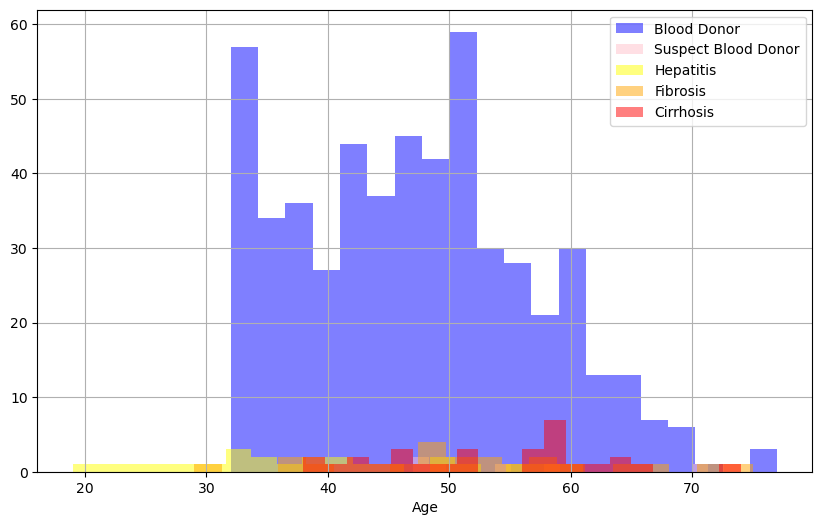
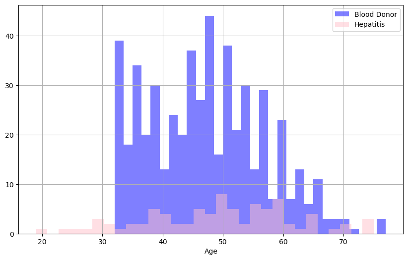
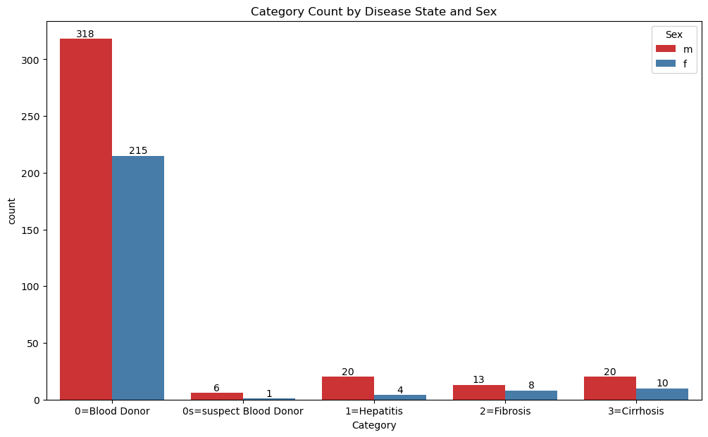
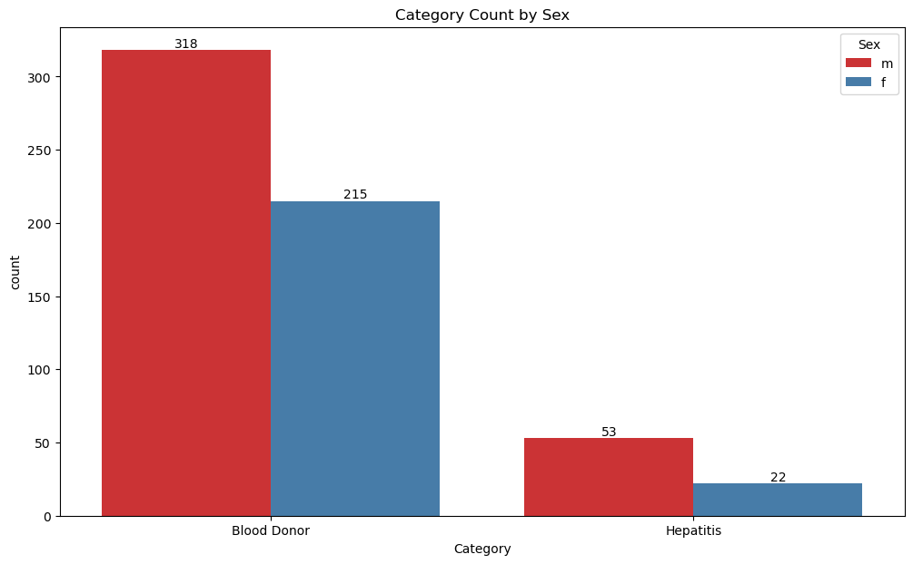
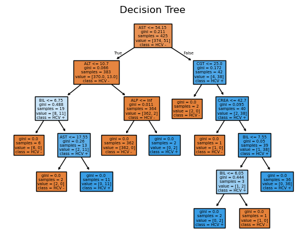
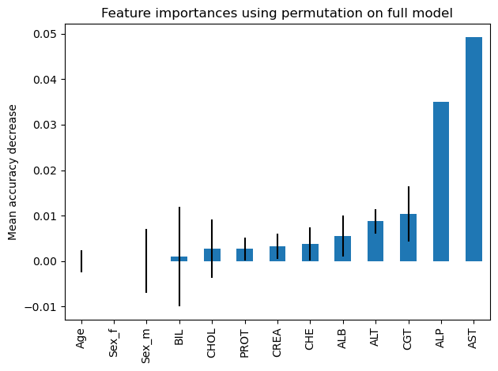
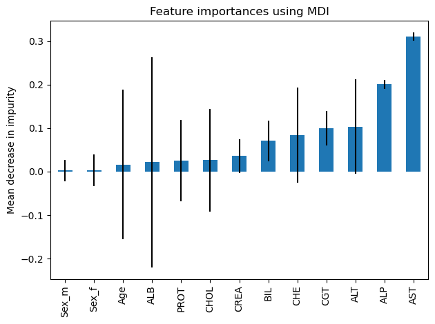

# Using a Random Forest Classification to Predict Hepatitis Infection
#### This dataset comes from the UC Irvine Machine Learning Repositiory. It contains laboratory values for blood donors and Hepatitis C patients, as well as some demographic information. There are 615 instances, and 12 features.

#### The goal of this project is to develop a model to predict whether a sample comes from a patient with Hepatitis C.
#### We'll make the model random forest classification. Random forest classification is a machine learning technique that works well for logistic problems such as ours, where there are only two possible answers. In this case either we predict that the sample donor is either positive or negative for Hepatitis C. Importantly, random forest classification can be used for problems with more than two possible answers.

### Install ucimlrepo, if it isn't already installed. Then import libraries, we'll import sklearn later.


```python
# Install ucimlrepo if not already installed
!pip3 install ucimlrepo

# Import libraries
from ucimlrepo import fetch_ucirepo 
import pandas as pd
import numpy as np
import seaborn as sns
import matplotlib.pyplot as plt
```

    Requirement already satisfied: ucimlrepo in c:\users\ssimp\anaconda3\lib\site-packages (0.0.7)
    Requirement already satisfied: pandas>=1.0.0 in c:\users\ssimp\anaconda3\lib\site-packages (from ucimlrepo) (2.2.2)
    Requirement already satisfied: certifi>=2020.12.5 in c:\users\ssimp\anaconda3\lib\site-packages (from ucimlrepo) (2025.1.31)
    Requirement already satisfied: numpy>=1.26.0 in c:\users\ssimp\anaconda3\lib\site-packages (from pandas>=1.0.0->ucimlrepo) (1.26.4)
    Requirement already satisfied: python-dateutil>=2.8.2 in c:\users\ssimp\anaconda3\lib\site-packages (from pandas>=1.0.0->ucimlrepo) (2.9.0.post0)
    Requirement already satisfied: pytz>=2020.1 in c:\users\ssimp\anaconda3\lib\site-packages (from pandas>=1.0.0->ucimlrepo) (2024.1)
    Requirement already satisfied: tzdata>=2022.7 in c:\users\ssimp\anaconda3\lib\site-packages (from pandas>=1.0.0->ucimlrepo) (2023.3)
    Requirement already satisfied: six>=1.5 in c:\users\ssimp\anaconda3\lib\site-packages (from python-dateutil>=2.8.2->pandas>=1.0.0->ucimlrepo) (1.16.0)
    


```python
# fetch dataset 
hcv_data = fetch_ucirepo(id=571) 
  
# data (as pandas dataframes) 
features = hcv_data.data.features 
targets = hcv_data.data.targets 
  
# metadata 
print(hcv_data.metadata) 
  
# variable information 
print(hcv_data.variables) 
```

    {'uci_id': 571, 'name': 'HCV data', 'repository_url': 'https://archive.ics.uci.edu/dataset/571/hcv+data', 'data_url': 'https://archive.ics.uci.edu/static/public/571/data.csv', 'abstract': 'The data set contains laboratory values of blood donors and Hepatitis C patients and demographic values like age.', 'area': 'Health and Medicine', 'tasks': ['Classification', 'Clustering'], 'characteristics': ['Multivariate'], 'num_instances': 615, 'num_features': 12, 'feature_types': ['Integer', 'Real'], 'demographics': ['Age', 'Sex'], 'target_col': ['Category'], 'index_col': ['ID'], 'has_missing_values': 'yes', 'missing_values_symbol': 'NaN', 'year_of_dataset_creation': 2020, 'last_updated': 'Fri Nov 03 2023', 'dataset_doi': '10.24432/C5D612', 'creators': ['Ralf Lichtinghagen', 'Frank Klawonn', 'Georg Hoffmann'], 'intro_paper': {'ID': 237, 'type': 'NATIVE', 'title': 'Using machine learning techniques to generate laboratory diagnostic pathways—a case study', 'authors': 'Georg F. Hoffmann, A. Bietenbeck, R. Lichtinghagen, F. Klawonn', 'venue': 'Journal of Laboratory and Precision Medicine', 'year': 2018, 'journal': None, 'DOI': '10.21037/jlpm.2018.06.01', 'URL': 'https://www.semanticscholar.org/paper/26d42f15a80f3629f5de44262891dd25979e4be3', 'sha': None, 'corpus': None, 'arxiv': None, 'mag': None, 'acl': None, 'pmid': None, 'pmcid': None}, 'additional_info': {'summary': "The target attribute for classification is Category (blood donors vs. Hepatitis C, including its progress: 'just' Hepatitis C, Fibrosis, Cirrhosis).", 'purpose': None, 'funded_by': None, 'instances_represent': 'Instances are patients', 'recommended_data_splits': None, 'sensitive_data': None, 'preprocessing_description': None, 'variable_info': "All attributes except Category and Sex are numerical. The laboratory data are the attributes 5-14. \r\n\t 1) X (Patient ID/No.)\r\n\t 2) Category (diagnosis) (values: '0=Blood Donor', '0s=suspect Blood Donor', '1=Hepatitis', '2=Fibrosis', '3=Cirrhosis')\r\n\t 3) Age (in years)\r\n\t 4) Sex (f,m)\r\n\t 5) ALB\r\n\t 6) ALP\r\n\t 7) ALT\r\n\t 8) AST\r\n\t 9) BIL\r\n\t10) CHE\r\n\t11) CHOL\r\n\t12) CREA\r\n\t13) GGT\r\n\t14) PROT\r\n", 'citation': None}}
            name     role         type demographic  \
    0         ID       ID      Integer        None   
    1        Age  Feature      Integer         Age   
    2        Sex  Feature       Binary         Sex   
    3        ALB  Feature   Continuous        None   
    4        ALP  Feature   Continuous        None   
    5        AST  Feature   Continuous        None   
    6        BIL  Feature   Continuous        None   
    7        CHE  Feature   Continuous        None   
    8       CHOL  Feature   Continuous        None   
    9       CREA  Feature   Continuous        None   
    10       CGT  Feature   Continuous        None   
    11      PROT  Feature   Continuous        None   
    12  Category   Target  Categorical        None   
    13       ALT  Feature   Continuous        None   
    
                                              description  units missing_values  
    0                                          Patient ID   None             no  
    1                                                None  years             no  
    2                                                None   None             no  
    3                                                None   None            yes  
    4                                                None   None            yes  
    5                                                None   None            yes  
    6                                                None   None             no  
    7                                                None   None             no  
    8                                                None   None            yes  
    9                                                None   None             no  
    10                                               None   None             no  
    11                                               None   None            yes  
    12  values: '0=Blood Donor', '0s=suspect Blood Don...   None             no  
    13                                               None   None             no  
    


```python
# Look at info, describe and head to get an idea of the data
features.info()
features.describe()
```

    <class 'pandas.core.frame.DataFrame'>
    RangeIndex: 615 entries, 0 to 614
    Data columns (total 12 columns):
     #   Column  Non-Null Count  Dtype  
    ---  ------  --------------  -----  
     0   Age     615 non-null    int64  
     1   Sex     615 non-null    object 
     2   ALB     614 non-null    float64
     3   ALP     597 non-null    float64
     4   AST     615 non-null    float64
     5   BIL     615 non-null    float64
     6   CHE     615 non-null    float64
     7   CHOL    605 non-null    float64
     8   CREA    615 non-null    float64
     9   CGT     615 non-null    float64
     10  PROT    614 non-null    float64
     11  ALT     614 non-null    float64
    dtypes: float64(10), int64(1), object(1)
    memory usage: 57.8+ KB
    


<div>
<style scoped>
    .dataframe tbody tr th:only-of-type {
        vertical-align: middle;
    }

    .dataframe tbody tr th {
        vertical-align: top;
    }

    .dataframe thead th {
        text-align: right;
    }
</style>
<table border="1" class="dataframe">
  <thead>
    <tr style="text-align: right;">
      <th></th>
      <th>Age</th>
      <th>ALB</th>
      <th>ALP</th>
      <th>AST</th>
      <th>BIL</th>
      <th>CHE</th>
      <th>CHOL</th>
      <th>CREA</th>
      <th>CGT</th>
      <th>PROT</th>
      <th>ALT</th>
    </tr>
  </thead>
  <tbody>
    <tr>
      <th>count</th>
      <td>615.000000</td>
      <td>614.000000</td>
      <td>597.000000</td>
      <td>615.000000</td>
      <td>615.000000</td>
      <td>615.000000</td>
      <td>605.000000</td>
      <td>615.000000</td>
      <td>615.000000</td>
      <td>614.000000</td>
      <td>614.000000</td>
    </tr>
    <tr>
      <th>mean</th>
      <td>47.408130</td>
      <td>41.620195</td>
      <td>68.283920</td>
      <td>34.786341</td>
      <td>11.396748</td>
      <td>8.196634</td>
      <td>5.368099</td>
      <td>81.287805</td>
      <td>39.533171</td>
      <td>72.044137</td>
      <td>28.450814</td>
    </tr>
    <tr>
      <th>std</th>
      <td>10.055105</td>
      <td>5.780629</td>
      <td>26.028315</td>
      <td>33.090690</td>
      <td>19.673150</td>
      <td>2.205657</td>
      <td>1.132728</td>
      <td>49.756166</td>
      <td>54.661071</td>
      <td>5.402636</td>
      <td>25.469689</td>
    </tr>
    <tr>
      <th>min</th>
      <td>19.000000</td>
      <td>14.900000</td>
      <td>11.300000</td>
      <td>10.600000</td>
      <td>0.800000</td>
      <td>1.420000</td>
      <td>1.430000</td>
      <td>8.000000</td>
      <td>4.500000</td>
      <td>44.800000</td>
      <td>0.900000</td>
    </tr>
    <tr>
      <th>25%</th>
      <td>39.000000</td>
      <td>38.800000</td>
      <td>52.500000</td>
      <td>21.600000</td>
      <td>5.300000</td>
      <td>6.935000</td>
      <td>4.610000</td>
      <td>67.000000</td>
      <td>15.700000</td>
      <td>69.300000</td>
      <td>16.400000</td>
    </tr>
    <tr>
      <th>50%</th>
      <td>47.000000</td>
      <td>41.950000</td>
      <td>66.200000</td>
      <td>25.900000</td>
      <td>7.300000</td>
      <td>8.260000</td>
      <td>5.300000</td>
      <td>77.000000</td>
      <td>23.300000</td>
      <td>72.200000</td>
      <td>23.000000</td>
    </tr>
    <tr>
      <th>75%</th>
      <td>54.000000</td>
      <td>45.200000</td>
      <td>80.100000</td>
      <td>32.900000</td>
      <td>11.200000</td>
      <td>9.590000</td>
      <td>6.060000</td>
      <td>88.000000</td>
      <td>40.200000</td>
      <td>75.400000</td>
      <td>33.075000</td>
    </tr>
    <tr>
      <th>max</th>
      <td>77.000000</td>
      <td>82.200000</td>
      <td>416.600000</td>
      <td>324.000000</td>
      <td>254.000000</td>
      <td>16.410000</td>
      <td>9.670000</td>
      <td>1079.100000</td>
      <td>650.900000</td>
      <td>90.000000</td>
      <td>325.300000</td>
    </tr>
  </tbody>
</table>
</div>


```python
features.head()
```


<div>
<style scoped>
    .dataframe tbody tr th:only-of-type {
        vertical-align: middle;
    }

    .dataframe tbody tr th {
        vertical-align: top;
    }

    .dataframe thead th {
        text-align: right;
    }
</style>
<table border="1" class="dataframe">
  <thead>
    <tr style="text-align: right;">
      <th></th>
      <th>Age</th>
      <th>Sex</th>
      <th>ALB</th>
      <th>ALP</th>
      <th>AST</th>
      <th>BIL</th>
      <th>CHE</th>
      <th>CHOL</th>
      <th>CREA</th>
      <th>CGT</th>
      <th>PROT</th>
      <th>ALT</th>
    </tr>
  </thead>
  <tbody>
    <tr>
      <th>0</th>
      <td>32</td>
      <td>m</td>
      <td>38.5</td>
      <td>52.5</td>
      <td>22.1</td>
      <td>7.5</td>
      <td>6.93</td>
      <td>3.23</td>
      <td>106.0</td>
      <td>12.1</td>
      <td>69.0</td>
      <td>7.7</td>
    </tr>
    <tr>
      <th>1</th>
      <td>32</td>
      <td>m</td>
      <td>38.5</td>
      <td>70.3</td>
      <td>24.7</td>
      <td>3.9</td>
      <td>11.17</td>
      <td>4.80</td>
      <td>74.0</td>
      <td>15.6</td>
      <td>76.5</td>
      <td>18.0</td>
    </tr>
    <tr>
      <th>2</th>
      <td>32</td>
      <td>m</td>
      <td>46.9</td>
      <td>74.7</td>
      <td>52.6</td>
      <td>6.1</td>
      <td>8.84</td>
      <td>5.20</td>
      <td>86.0</td>
      <td>33.2</td>
      <td>79.3</td>
      <td>36.2</td>
    </tr>
    <tr>
      <th>3</th>
      <td>32</td>
      <td>m</td>
      <td>43.2</td>
      <td>52.0</td>
      <td>22.6</td>
      <td>18.9</td>
      <td>7.33</td>
      <td>4.74</td>
      <td>80.0</td>
      <td>33.8</td>
      <td>75.7</td>
      <td>30.6</td>
    </tr>
    <tr>
      <th>4</th>
      <td>32</td>
      <td>m</td>
      <td>39.2</td>
      <td>74.1</td>
      <td>24.8</td>
      <td>9.6</td>
      <td>9.15</td>
      <td>4.32</td>
      <td>76.0</td>
      <td>29.9</td>
      <td>68.7</td>
      <td>32.6</td>
    </tr>
  </tbody>
</table>
</div>


```python
# Do the same for y
targets.info()
targets.describe()
```

    <class 'pandas.core.frame.DataFrame'>
    RangeIndex: 615 entries, 0 to 614
    Data columns (total 1 columns):
     #   Column    Non-Null Count  Dtype 
    ---  ------    --------------  ----- 
     0   Category  615 non-null    object
    dtypes: object(1)
    memory usage: 4.9+ KB
    


<div>
<style scoped>
    .dataframe tbody tr th:only-of-type {
        vertical-align: middle;
    }

    .dataframe tbody tr th {
        vertical-align: top;
    }

    .dataframe thead th {
        text-align: right;
    }
</style>
<table border="1" class="dataframe">
  <thead>
    <tr style="text-align: right;">
      <th></th>
      <th>Category</th>
    </tr>
  </thead>
  <tbody>
    <tr>
      <th>count</th>
      <td>615</td>
    </tr>
    <tr>
      <th>unique</th>
      <td>5</td>
    </tr>
    <tr>
      <th>top</th>
      <td>0=Blood Donor</td>
    </tr>
    <tr>
      <th>freq</th>
      <td>533</td>
    </tr>
  </tbody>
</table>
</div>


```python
targets.head()
```


<div>
<style scoped>
    .dataframe tbody tr th:only-of-type {
        vertical-align: middle;
    }

    .dataframe tbody tr th {
        vertical-align: top;
    }

    .dataframe thead th {
        text-align: right;
    }
</style>
<table border="1" class="dataframe">
  <thead>
    <tr style="text-align: right;">
      <th></th>
      <th>Category</th>
    </tr>
  </thead>
  <tbody>
    <tr>
      <th>0</th>
      <td>0=Blood Donor</td>
    </tr>
    <tr>
      <th>1</th>
      <td>0=Blood Donor</td>
    </tr>
    <tr>
      <th>2</th>
      <td>0=Blood Donor</td>
    </tr>
    <tr>
      <th>3</th>
      <td>0=Blood Donor</td>
    </tr>
    <tr>
      <th>4</th>
      <td>0=Blood Donor</td>
    </tr>
  </tbody>
</table>
</div>


```python
# y is the disease status/ state and is what this model will try to predict. What are its unique values?
targets.Category.unique()
```


    array(['0=Blood Donor', '0s=suspect Blood Donor', '1=Hepatitis',
           '2=Fibrosis', '3=Cirrhosis'], dtype=object)


```python
# Combine into one data frame
all_data = pd.concat([targets, features], axis = 1)
all_data.head()
```


<div>
<style scoped>
    .dataframe tbody tr th:only-of-type {
        vertical-align: middle;
    }

    .dataframe tbody tr th {
        vertical-align: top;
    }

    .dataframe thead th {
        text-align: right;
    }
</style>
<table border="1" class="dataframe">
  <thead>
    <tr style="text-align: right;">
      <th></th>
      <th>Category</th>
      <th>Age</th>
      <th>Sex</th>
      <th>ALB</th>
      <th>ALP</th>
      <th>AST</th>
      <th>BIL</th>
      <th>CHE</th>
      <th>CHOL</th>
      <th>CREA</th>
      <th>CGT</th>
      <th>PROT</th>
      <th>ALT</th>
    </tr>
  </thead>
  <tbody>
    <tr>
      <th>0</th>
      <td>0=Blood Donor</td>
      <td>32</td>
      <td>m</td>
      <td>38.5</td>
      <td>52.5</td>
      <td>22.1</td>
      <td>7.5</td>
      <td>6.93</td>
      <td>3.23</td>
      <td>106.0</td>
      <td>12.1</td>
      <td>69.0</td>
      <td>7.7</td>
    </tr>
    <tr>
      <th>1</th>
      <td>0=Blood Donor</td>
      <td>32</td>
      <td>m</td>
      <td>38.5</td>
      <td>70.3</td>
      <td>24.7</td>
      <td>3.9</td>
      <td>11.17</td>
      <td>4.80</td>
      <td>74.0</td>
      <td>15.6</td>
      <td>76.5</td>
      <td>18.0</td>
    </tr>
    <tr>
      <th>2</th>
      <td>0=Blood Donor</td>
      <td>32</td>
      <td>m</td>
      <td>46.9</td>
      <td>74.7</td>
      <td>52.6</td>
      <td>6.1</td>
      <td>8.84</td>
      <td>5.20</td>
      <td>86.0</td>
      <td>33.2</td>
      <td>79.3</td>
      <td>36.2</td>
    </tr>
    <tr>
      <th>3</th>
      <td>0=Blood Donor</td>
      <td>32</td>
      <td>m</td>
      <td>43.2</td>
      <td>52.0</td>
      <td>22.6</td>
      <td>18.9</td>
      <td>7.33</td>
      <td>4.74</td>
      <td>80.0</td>
      <td>33.8</td>
      <td>75.7</td>
      <td>30.6</td>
    </tr>
    <tr>
      <th>4</th>
      <td>0=Blood Donor</td>
      <td>32</td>
      <td>m</td>
      <td>39.2</td>
      <td>74.1</td>
      <td>24.8</td>
      <td>9.6</td>
      <td>9.15</td>
      <td>4.32</td>
      <td>76.0</td>
      <td>29.9</td>
      <td>68.7</td>
      <td>32.6</td>
    </tr>
  </tbody>
</table>
</div>


### How does our distribution look by age?


```python
# Look at disease state by age
plt.figure(figsize = (10,6))
all_data[all_data['Category']== '0=Blood Donor']['Age'].hist(alpha = 0.5, color = 'blue', bins = 20, label = "Blood Donor" )
all_data[all_data['Category']== '0s=suspect Blood Donor']['Age'].hist(alpha = 0.5, color = 'pink', bins = 20, label = "Suspect Blood Donor" )
all_data[all_data['Category']== '1=Hepatitis']['Age'].hist(alpha = 0.5, color = 'yellow', bins = 20, label = "Hepatitis" )
all_data[all_data['Category']== '2=Fibrosis']['Age'].hist(alpha = 0.5, color = 'orange', bins = 20, label = "Fibrosis" )
all_data[all_data['Category']== '3=Cirrhosis']['Age'].hist(alpha = 0.5, color = 'red', bins = 20, label = "Cirrhosis" )

plt.legend()
plt.xlabel('Age')
```


    Text(0.5, 0, 'Age')


    

    


### That looks a bit skewed, unfortunately none of the healthy blood donor samples are below age 32. This has nothing to do with disease state and more to do with the sampling method for this dataset. However we do have the following insights:
* No one under age 30 who is Hepatitis C positive has Fibrosis or Cirrhosis. This makes sense as the disease progresses with age. 

#### Let's try combining all Hepatitis positive groups into a single label. How does that distribution look?


```python
# Look at disease state by grouping 
plt.figure(figsize = (10,6))
all_data[all_data['Category']== '0=Blood Donor']['Age'].hist(alpha = 0.5, color = 'blue', bins = 30, label = "Blood Donor" )
all_data[all_data['Category']!= '0=Blood Donor']['Age'].hist(alpha = 0.5, color = 'pink', bins = 30, label = "Hepatitis" )
plt.legend()
plt.xlabel('Age')
```


    Text(0.5, 0, 'Age')


    

    


### How many of instances of each category are present? And how is the distribution when we consider our demographic variable, sex?


```python
# How many of each sex were diagnosed?
plt.figure(figsize=(12,7))
ax = sns.countplot(data=all_data, x='Category', hue='Sex',palette='Set1')
ax.bar_label(ax.containers[0])
ax.bar_label(ax.containers[1])
ax.set_title("Category Count by Disease State and Sex")
```


    Text(0.5, 1.0, 'Category Count by Disease State and Sex')


    

    


# Prepare data for analysis
* Drop Suspect Blood Donors as they aren't confirmed and there are so few of them. Including only 1 female sample.
* Make 'Sex' a categorical 

## Then combine all HCV positive samples under a single label, giving two categories Hepatitis C positive patient or Healthy Blood Donor
#### We do this for a few reasons shown in the exploratory analysis above:
* Some categories have very few instances. We want to limit imbalanced data as much as possible.
* Later on we'll be dividing the data into a training set and a test set, we want to make sure there will be enough instances for both.
* The goal of this model is to predict whether a sample comes from someone with Hepatitis C or is from a healthy blood donor. Predicting disease state is out of scope here.


```python
# Drop suspected blood donors from the model
rows_to_drop = all_data[all_data['Category'] == '0s=suspect Blood Donor'].index
hep_data = all_data.drop(rows_to_drop)

hep_data.info()
```

    <class 'pandas.core.frame.DataFrame'>
    Index: 608 entries, 0 to 614
    Data columns (total 13 columns):
     #   Column    Non-Null Count  Dtype  
    ---  ------    --------------  -----  
     0   Category  608 non-null    object 
     1   Age       608 non-null    int64  
     2   Sex       608 non-null    object 
     3   ALB       607 non-null    float64
     4   ALP       590 non-null    float64
     5   AST       608 non-null    float64
     6   BIL       608 non-null    float64
     7   CHE       608 non-null    float64
     8   CHOL      598 non-null    float64
     9   CREA      608 non-null    float64
     10  CGT       608 non-null    float64
     11  PROT      607 non-null    float64
     12  ALT       607 non-null    float64
    dtypes: float64(10), int64(1), object(2)
    memory usage: 66.5+ KB
    


```python
# Sex should be categorial for sklearn to be able to understand it we can use pd.get_dummies to do this
final_data = pd.get_dummies(hep_data, columns = ['Sex'])
final_data.info()
```

    <class 'pandas.core.frame.DataFrame'>
    Index: 608 entries, 0 to 614
    Data columns (total 14 columns):
     #   Column    Non-Null Count  Dtype  
    ---  ------    --------------  -----  
     0   Category  608 non-null    object 
     1   Age       608 non-null    int64  
     2   ALB       607 non-null    float64
     3   ALP       590 non-null    float64
     4   AST       608 non-null    float64
     5   BIL       608 non-null    float64
     6   CHE       608 non-null    float64
     7   CHOL      598 non-null    float64
     8   CREA      608 non-null    float64
     9   CGT       608 non-null    float64
     10  PROT      607 non-null    float64
     11  ALT       607 non-null    float64
     12  Sex_f     608 non-null    bool   
     13  Sex_m     608 non-null    bool   
    dtypes: bool(2), float64(10), int64(1), object(1)
    memory usage: 62.9+ KB
    

## Combine all Hepatitis conditions to predict infection status not disease state
* Then look at new attributes


```python
hep_dict = dict.fromkeys(['1=Hepatitis', '2=Fibrosis', '3=Cirrhosis'], 'Hepatitis')

final_data = hep_data.replace(hep_dict)
final_data = final_data.replace('0=Blood Donor', 'Blood Donor')
```


```python
# How many of each sex were diagnosed?
plt.figure(figsize=(12,7))
ax = sns.countplot(data=final_data, x='Category', hue='Sex',palette='Set1')
ax.bar_label(ax.containers[0])
ax.bar_label(ax.containers[1])
ax.set_title("Category Count by Sex")
```


    Text(0.5, 1.0, 'Category Count by Sex')


    

    


```python
# Sex should be categorial for sklearn to be able to understand it we can use pd.get_dummies to do this
final_data = pd.get_dummies(final_data, columns = ['Sex'])
final_data.info()
```

    <class 'pandas.core.frame.DataFrame'>
    Index: 608 entries, 0 to 614
    Data columns (total 14 columns):
     #   Column    Non-Null Count  Dtype  
    ---  ------    --------------  -----  
     0   Category  608 non-null    object 
     1   Age       608 non-null    int64  
     2   ALB       607 non-null    float64
     3   ALP       590 non-null    float64
     4   AST       608 non-null    float64
     5   BIL       608 non-null    float64
     6   CHE       608 non-null    float64
     7   CHOL      598 non-null    float64
     8   CREA      608 non-null    float64
     9   CGT       608 non-null    float64
     10  PROT      607 non-null    float64
     11  ALT       607 non-null    float64
     12  Sex_f     608 non-null    bool   
     13  Sex_m     608 non-null    bool   
    dtypes: bool(2), float64(10), int64(1), object(1)
    memory usage: 62.9+ KB
    

# Split data into training and test sets


```python
# Split data into a training set and a testing set
from sklearn.model_selection import train_test_split
```


```python
# Split data category off from features
X = final_data.drop('Category',axis = 1)
y = final_data['Category']

X_train, X_test, y_train, y_test = train_test_split(X, y, test_size = 0.3, random_state = 42)
```

# Start with a Decision Tree


```python
# Time to train the model
from sklearn.tree import DecisionTreeClassifier
from sklearn.tree import plot_tree
```


```python
dtree = DecisionTreeClassifier()
```


```python
dtree.fit(X_train, y_train)
```


## What does our decision tree look like?


```python
plot_tree(dtree, feature_names = X.columns , class_names = ['HCV -', 'HCV +'], filled = True)
plt.title("Decision Tree")
```


    Text(0.5, 1.0, 'Decision Tree')


    

    


```python
predictions = dtree.predict(X_test)
```


```python
from sklearn.metrics import classification_report, confusion_matrix
```


```python
print(classification_report(y_test, predictions))
```

                  precision    recall  f1-score   support
    
     Blood Donor       0.96      0.99      0.98       159
       Hepatitis       0.90      0.75      0.82        24
    
        accuracy                           0.96       183
       macro avg       0.93      0.87      0.90       183
    weighted avg       0.95      0.96      0.95       183
    
    


```python
print(confusion_matrix(y_test, predictions))
```

    [[157   2]
     [  6  18]]
    

# Now use a Random Forest Model, which utilizes multiple decision trees


```python
from sklearn.ensemble import RandomForestClassifier
```


```python
rfc = RandomForestClassifier()
```


```python
rfc.fit(X_train, y_train)
```


```python
predictions = rfc.predict(X_test)
```


```python
print(classification_report(y_test, predictions))
```

                  precision    recall  f1-score   support
    
     Blood Donor       0.96      1.00      0.98       159
       Hepatitis       1.00      0.75      0.86        24
    
        accuracy                           0.97       183
       macro avg       0.98      0.88      0.92       183
    weighted avg       0.97      0.97      0.97       183
    
    


```python
print(confusion_matrix(y_test, predictions))
```

    [[159   0]
     [  6  18]]
    


```python
print(f"RF train accuracy: {rfc.score(X_train, y_train):.3f}")
print(f"RF test accuracy: {rfc.score(X_test, y_test):.3f}")
```

    RF train accuracy: 1.000
    RF test accuracy: 0.967
    

# What features are most important for the model?

## Look at Importance


```python
from sklearn.inspection import permutation_importance
```


```python
feature_names = X.columns

results = permutation_importance(rfc, X_test, y_test, n_repeats = 10, n_jobs =2)
results
forest_importances = pd.Series(results.importances_mean, index = feature_names).sort_values(ascending = True)
```


```python
fig, ax = plt.subplots()
forest_importances.plot.bar(yerr=results.importances_std, ax=ax)
ax.set_title("Feature importances using permutation on full model")
ax.set_ylabel("Mean accuracy decrease")
fig.tight_layout()
plt.show()
```


    

    


### ALP and AST are the most important features according to analysis based on permutations
* AST stands for aspartate aminotransferase. It's an enzyme that speeds up chemical reactions in the body, it's found primarily in organs and tissues with relatively little found in blood. However, AST is released into the bloodstream following liver damage, or damage to AST producing cells. It makes sense that AST would be importnant here.
* ALP stands for alkaline phosphatase, another enzyme found in the liver (as well as some other tissues and bone). It's believed to be involved in multiple processes. While it doesn't directly indicate liver damage or inflammation elevated levels signal a problem with bile flow or pressure within the liver.

# What each features GINI index?
* This is used to evaluate the quality of a split in a decision tree or purity. Since each node represents a split around a single feature we prefer nodes (and thus features) where samples are split and correctly classified. A lower index means a purer split, meaning data points in resulting nodes are more likely to belong to the same class.


```python
mdi_importances = pd.Series(rfc.feature_importances_, index = feature_names).sort_values(ascending = True)
std = np.std([tree.feature_importances_ for tree in rfc.estimators_], axis=0)
```


## Note: The graph below shows the Mean decrease in impurity. So higher values are associated with lower GINI indexes.


```python

fig, ax = plt.subplots()
mdi_importances.plot.bar(yerr=std, ax=ax)
ax.set_title("Feature importances using MDI")
ax.set_ylabel("Mean decrease in impurity")
fig.tight_layout()
```


    

    


### Once again ALP and AST are the most important features, although their positions have switched.

# Does our model also think the suspect Blood donor samples may be from HCV positive persons?
### Remember to make Sex a categorical variable


```python
suspected_samples = all_data[all_data['Category'] == '0s=suspect Blood Donor']
# Now drop the Category Column
suspected_samples = suspected_samples.drop( axis = 'columns', columns = 'Category')

suspected_samples = pd.get_dummies(suspected_samples, columns = ['Sex'])
suspected_samples.info()
```

    <class 'pandas.core.frame.DataFrame'>
    Index: 7 entries, 533 to 539
    Data columns (total 13 columns):
     #   Column  Non-Null Count  Dtype  
    ---  ------  --------------  -----  
     0   Age     7 non-null      int64  
     1   ALB     7 non-null      float64
     2   ALP     7 non-null      float64
     3   AST     7 non-null      float64
     4   BIL     7 non-null      float64
     5   CHE     7 non-null      float64
     6   CHOL    7 non-null      float64
     7   CREA    7 non-null      float64
     8   CGT     7 non-null      float64
     9   PROT    7 non-null      float64
     10  ALT     7 non-null      float64
     11  Sex_f   7 non-null      bool   
     12  Sex_m   7 non-null      bool   
    dtypes: bool(2), float64(10), int64(1)
    memory usage: 686.0 bytes
    


```python
suspect_predictions = rfc.predict(suspected_samples)
print(suspect_predictions)
```

    ['Blood Donor' 'Blood Donor' 'Blood Donor' 'Blood Donor' 'Blood Donor'
     'Blood Donor' 'Hepatitis']
    
